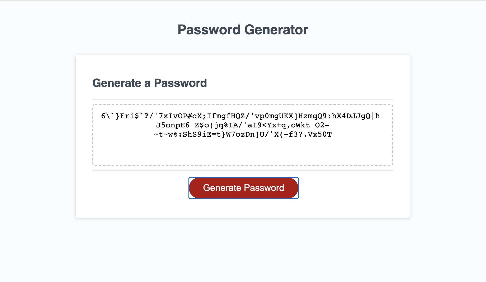

# Password-Generator
Web application that generates a costume password, where you can choose special characters, numeric, 
uppercase or lowercase.

## Objective
```
GIVEN I need a new, secure password
WHEN I click the button to generate a password
THEN I am presented with a series of prompts for password criteria
WHEN prompted for password criteria
THEN I select which criteria to include in the password
WHEN prompted for the length of the password
THEN I choose a length of at least 8 characters and no more than 128 characters
WHEN prompted for character types to include in the password
THEN I choose lowercase, uppercase, numeric, and/or special characters
WHEN I answer each prompt
THEN my input should be validated and at least one character type should be selected
WHEN all prompts are answered
THEN a password is generated that matches the selected criteria
WHEN the password is generated
THEN the password is either displayed in an alert or written to the page
```

 
## Getting Started

These instructions will get you a copy of the project up and running on your local machine for development and testing purposes. See deployment for notes on how to deploy the project on a live system.

```
$ git clone git@github.com:Cherjios/Password-Generator.git
$ cd Password-Generator.git
```
Then open in your preferred text editor:
- [vim](https://www.vim.org/) 
- [emmacs](https://www.gnu.org/software/emacs/)
- [visual studio code](https://code.visualstudio.com/) 

## Website view



## Built With

* [HTML](https://developer.mozilla.org/en-US/docs/Web/HTML)
* [CSS](https://developer.mozilla.org/en-US/docs/Web/CSS)
* [JS](https://developer.mozilla.org/en-US/docs/Web/JavaScript)

## Deployed Link

* [Deploy a website to github](https://www.google.com/search?rlz=1C5CHFA_enUS876US878&sxsrf=ALeKk03L-krWYrY46bsiZVRE3DFHIEULGA%3A1591932240148&ei=UPXiXsrBCLW90PEPsvWSwAY&q=deploy+a+website+on+github&oq=deploy+a+website+on+github&gs_lcp=CgZwc3ktYWIQAzIECAAQQzIGCAAQFhAeMgYIABAWEB4yBggAEBYQHjoECCMQJzoFCAAQkQI6BQgAELEDOgcIABCxAxBDOgIIADoHCAAQFBCHAlDcMFjZUmDGVGgAcAB4AIABZogBoAeSAQQxMC4xmAEAoAEBqgEHZ3dzLXdpeg&sclient=psy-ab&ved=0ahUKEwjKqbjdqfvpAhW1HjQIHbK6BGgQ4dUDCAw&uact=5)


## Authors

* **SERGIO LOPEZ** 

- [Link to Portfolio Site](#)
- [Link to Github](https://github.com/cherjios)
- [Link to LinkedIn](https://www.linkedin.com/in/sergio-lopez-81790579)


